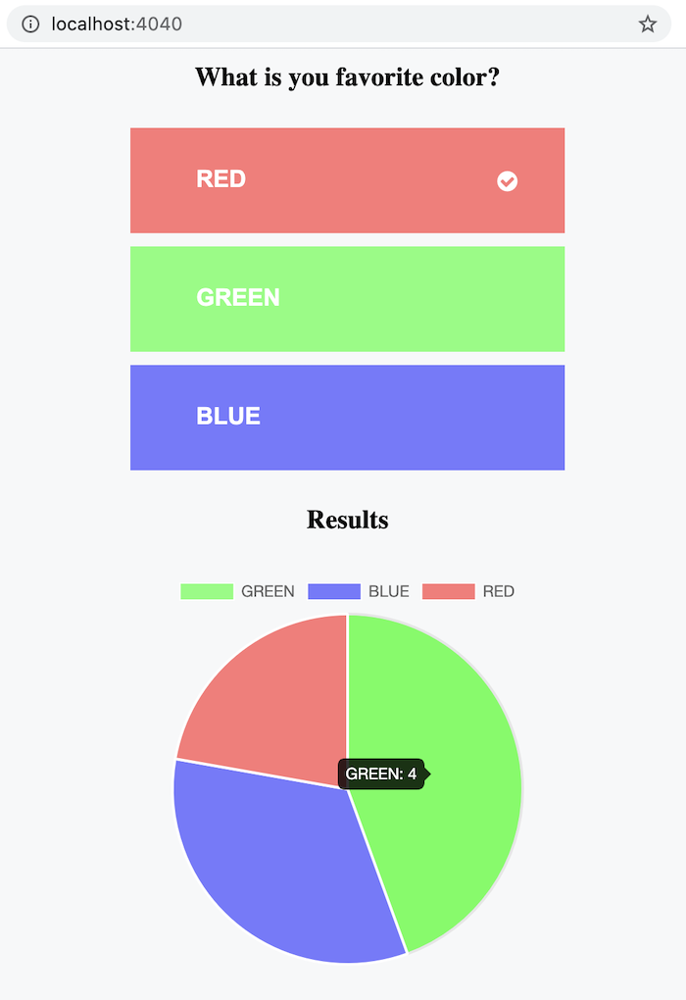

# Color Voting Application

## Technology Stack
- Language: Java 11.
- Web Server: [SparkJava](https://sparkjava.com/).
- UI: [Vue.js](https://vuejs.org/).
- Data Storage: [H2](https://www.h2database.com/).
- Data Access: [jOOQ](https://www.jooq.org/).
- Data-Interchange Format: [Jackson JSON](https://github.com/FasterXML/jackson).
- Unit Testing: [JUnit 5](https://junit.org/junit5/), [Hamcrest](http://hamcrest.org/JavaHamcrest/),
  [Mockito](https://site.mockito.org/).
- Build Tool: [Apache Maven](https://maven.apache.org/).
- Container: [Docker](https://www.docker.com/).

### Build
````bash
$ mvn package
````
### Run
````bash
$ PORT=4040 java -jar target/votingapp.jar
````

### Build Docker Image
````bash
$ docker image build -t votingapp:latest .
````

### Run in Docker Container
````bash
$ docker container run --rm -ti -p 4040:4040 --env PORT=4040 votingapp:latest
````

### Open in Browser

http://localhost:4040/



